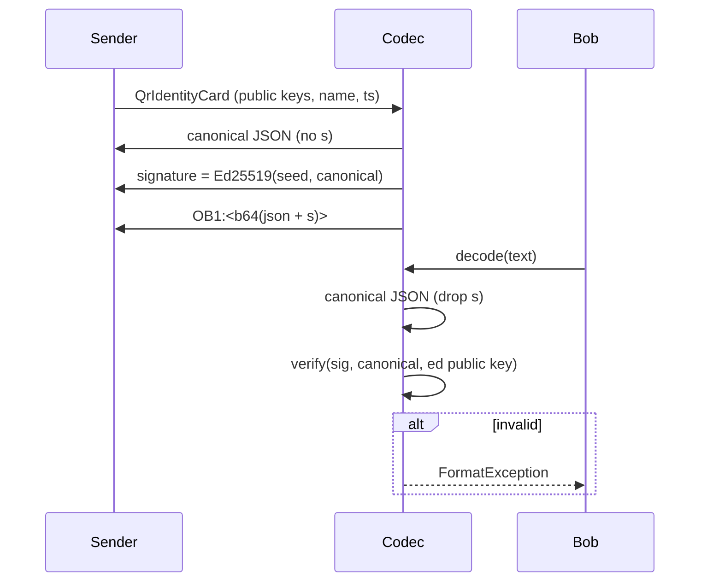

# QR wire protocol (`OB1:`)

Every OneBit QR identity payload is:

```
OB1:<base64url(utf8(json))>
```

`base64url` here means the URL-safe alphabet with `=` padding stripped.
`QrPayloadCodec` (`lib/core/crypto/identity/qr_payload.dart`).

## Canonical JSON

Fields always serialize in a fixed order so signatures are reproducible:

```
v   version              (1)
t   payload type         ("id" | "xfer")
ts  unix seconds         (card only: proof the document was just produced)
id  NODE-XXXX-XXXX
n   display name
fp  64-char fingerprint hex
ed  base64url ed25519 public key
x   base64url x25519 public key
s   base64url ed25519 signature (cards only)
u   base64url sealed envelope (transfers only)
```

Unknown fields outside the order are ignored. When serializing for signing or
verifying, the `s` field is **excluded**, so re-parsing a received document
and re-signing reproduces exactly the signed bytes.

## Type `id` — identity card (public)



- Anyone can read a card; integrity/authenticity comes from the Ed25519
  signature over the canonical document.
- The verifier is supplied by the caller (`PayloadVerifier`); on device it is
  `IdentityCrypto.verify` against the card's own `ed` key.

## Type `xfer` — identity transfer (seed migration)

The `u` field carries `ephemeral public‖nonce‖mac‖ciphertext`:

```
ephemeralPublic (32 B)   fresh X25519 public key for this transfer only
nonce           (12 B)   AES-256-GCM nonce
mac             (16 B)   AES-256-GCM tag
cipherText      (*)      AES-256-GCM of the transferred content
```

Key schedule:

```
shared = ECDH(ephemeralPrivate, recipientX25519Public)
key    = HKDF-SHA256(shared, salt = ephemeralPublic, info = "onebit/qr/transfer/v1")
```

Cleartext (encrypted, `_contentJson`):

```
{ v, id, n, fp, seed, xseed }   seed/xseed are base64url 32-byte seeds
```

```mermaid
sequenceDiagram
  Alice->>Codec: encodeTransfer(content, recipientPublicKey)
  Codec->>Codec: fresh ephemeral X25519 key
  Codec->>Codec: shared = ECDH(ephPriv, recipientPub)
  Codec->>Codec: AES-256-GCM(key, nonce, content)
  Codec-->>Alice: OB1 data with u = ephPub‖nonce‖mac‖ct
  Alice-->>Bob: QR
  Bob->>Codec: decodeTransfer(sharedSecretProvider)
  Codec->>Codec: shared = ECDH(bobPriv, ephPub)
  Codec->>Codec: decrypt; auth fails for wrong recipient / tamper
  Codec-->>Bob: QrTransferContent(seed, xseed) | SecretBoxAuthenticationError
```

Because the codec generates the ephemeral key itself, sealing needs no
private material from the sender; any content can be sealed to a given
public key. Only the holder of the recipient's X25519 private key can open
the envelope. GCM supplies integrity, so a tampered document fails
authentication rather than presenting garbage.

## Failures

Decode paths throw:

| Condition | Result |
| --- | --- |
| Wrong prefix (not `OB1:`) | `FormatException` |
| Unsupported `v` / wrong `t` | `FormatException` |
| Missing/invalid `id`, `fp` | `FormatException` |
| Card `s` missing or fails | `FormatException` |
| Envelope too short / wrong recipient / tampered MAC | `SecretBoxAuthenticationError` (transfer) / auth error |

## Related

- `docs/identity/architecture.md`, `lib/core/crypto/identity/qr_payload.dart`,
  `test/core/crypto/identity/qr_payload_test.dart`.