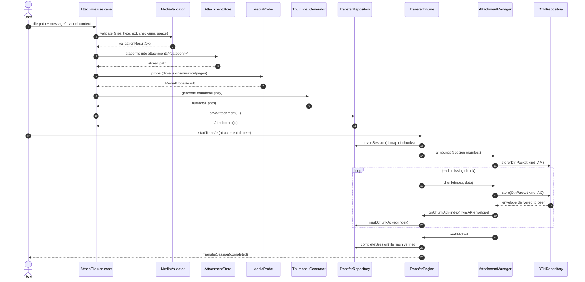
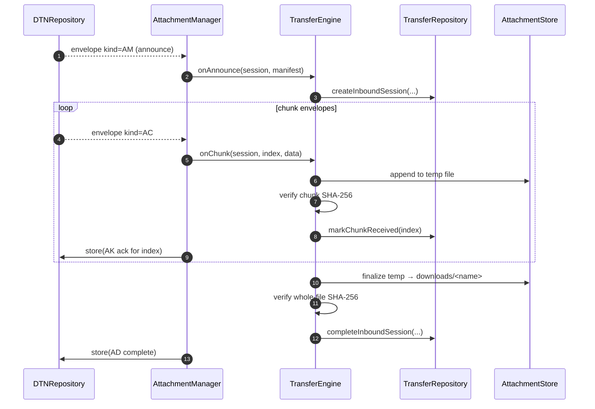
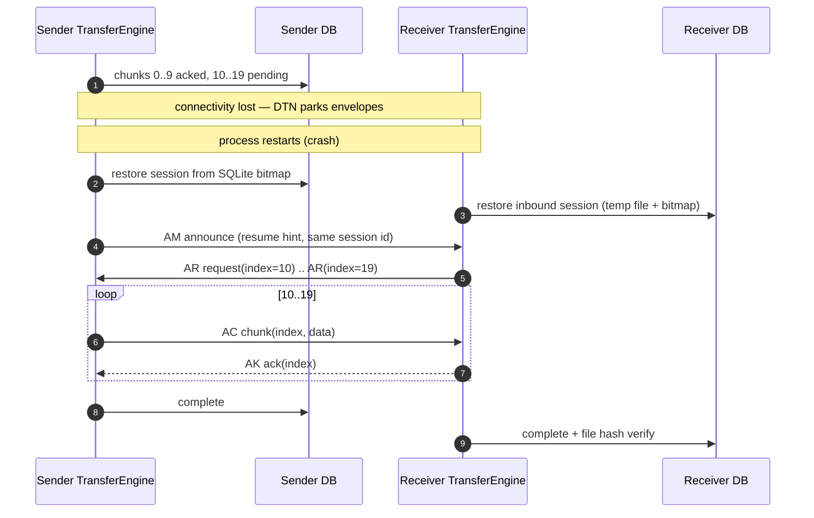
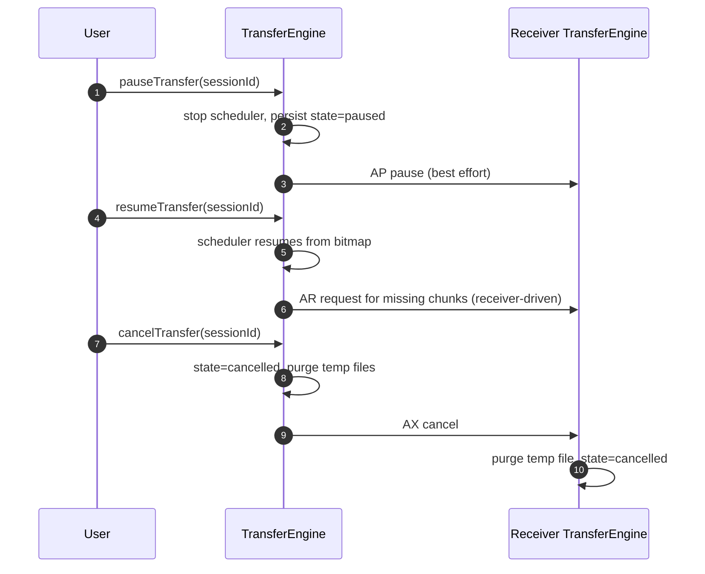
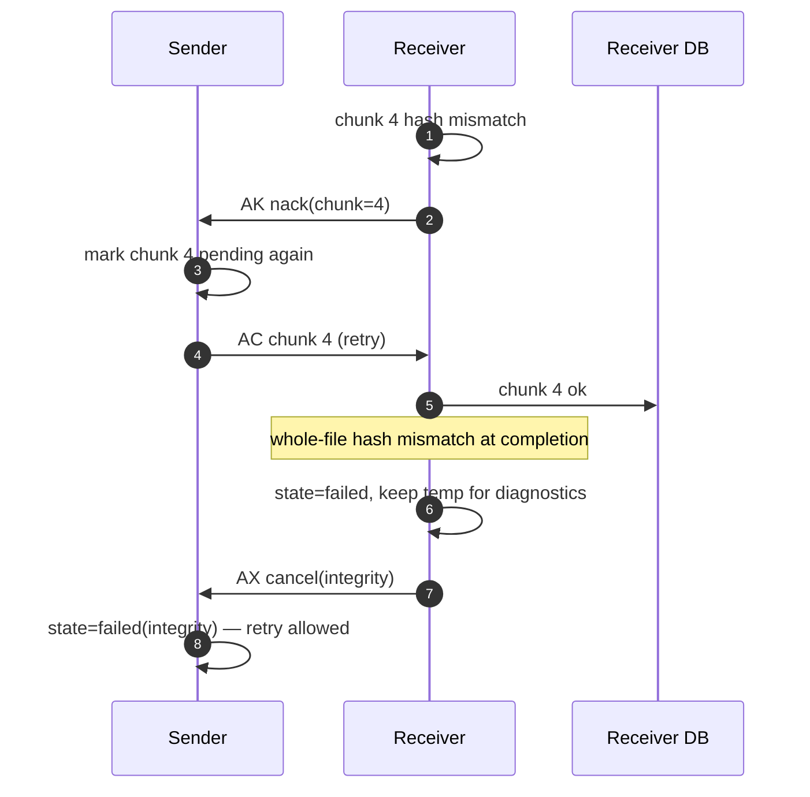

# 03 — Sequence Diagrams

## 3.1 Attach → Transfer → Delivered (happy path)

## 3.2 Receive side (receiver node)

## 3.3 Interrupted transfer + resume

## 3.4 Pause / Cancel

## 3.5 Integrity failure path

