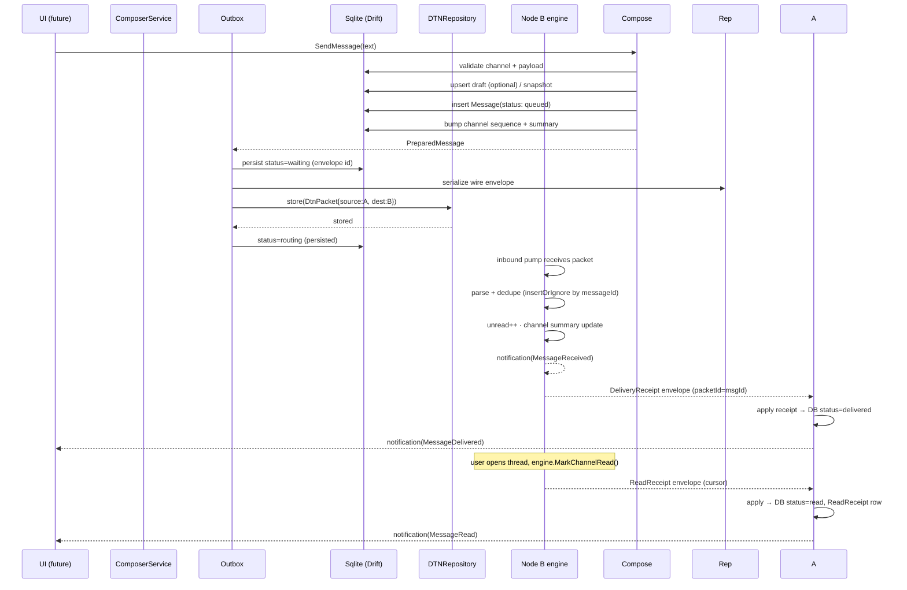
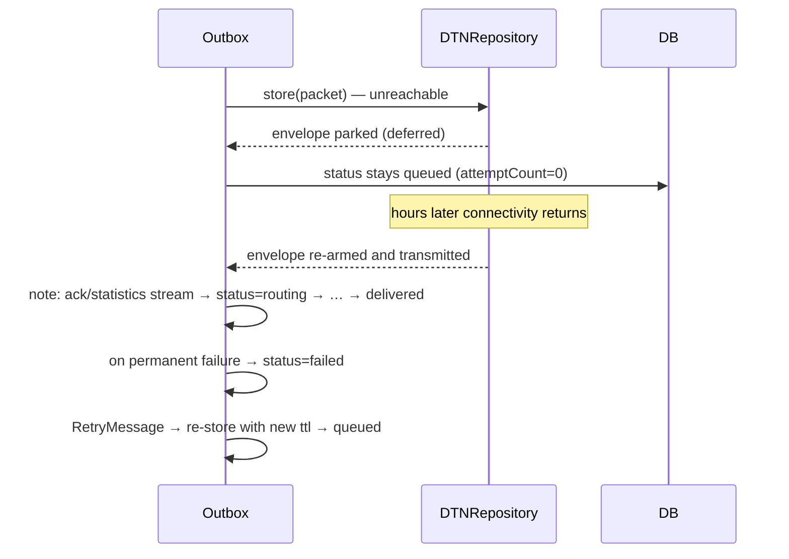
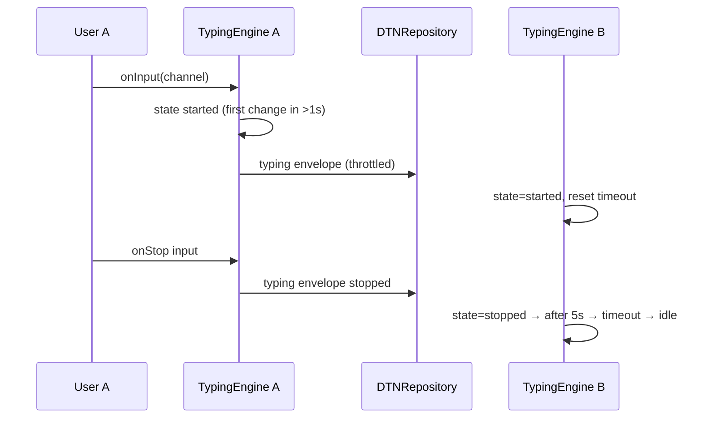
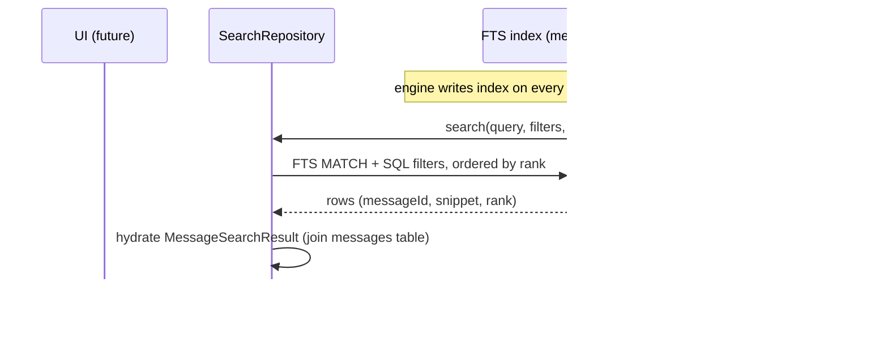

# Sequence Diagram — End-to-End Message Lifecycle

## Send path (node A → node B)

```mermaid
sequenceDiagram
    participant UI as UI (future)
    participant Comp as ComposerService
    participant Out as Outbox
    participant DB as Sqlite (Drift)
    participant DTN as DTNRepository
    participant B as Node B engine

    UI->>Compose: SendMessage(text)
    Compose->>DB: validate channel + payload
    Compose->>DB: upsert draft (optional) / snapshot
    Compose->>DB: insert Message(status: queued)
    Compose->>DB: bump channel sequence + summary
    Compose-->>Out: PreparedMessage
    Out->>DB: persist status=waiting (envelope id)
    Out->>Rep: serialize wire envelope
    Out->>DTN: store(DtnPacket{source:A, dest:B})
    DTN-->>Out: stored
    Out->>DB: status=routing (persisted)
    B->>B: inbound pump receives packet
    B->>B: parse + dedupe (insertOrIgnore by messageId)
    B->>B: unread++ · channel summary update
    B-->>B: notification(MessageReceived)
    B-->>A: DeliveryReceipt envelope (packetId=msgId)
    A->>A: apply receipt → DB status=delivered
    A-->>UI: notification(MessageDelivered)
    Note over B: user opens thread, engine.MarkChannelRead()
    B-->>A: ReadReceipt envelope (cursor)
    A->>A: apply → DB status=read, ReadReceipt row
    A-->>UI: notification(MessageRead)
```

## Retry / resend path (offline)

```mermaid
sequenceDiagram
    participant Out as Outbox
    participant DTN as DTNRepository

    Out->>DTN: store(packet) — unreachable
    DTN-->>Out: envelope parked (deferred)
    Out->>DB: status stays queued (attemptCount=0)
    Note over DTN: hours later connectivity returns
    DTN-->>Out: envelope re-armed and transmitted
    Out->>Out: note: ack/statistics stream → status=routing → … → delivered
    Out->>Out: on permanent failure → status=failed
    Out->>Out: RetryMessage → re-store with new ttl → queued
```

## Typing path (throttled)

```mermaid
sequenceDiagram
    participant U as User A
    participant T as TypingEngine A
    participant DTN as DTNRepository
    participant B as TypingEngine B

    U->>T: onInput(channel)
    T->>T: state started (first change in >1s)
    T->>DTN: typing envelope (throttled)
    B->>B: state=started, reset timeout
    U->>T: onStop input
    T->>DTN: typing envelope stopped
    B->>B: state=stopped → after 5s → timeout → idle
```

## Search path

```mermaid
sequenceDiagram
    participant UI as UI (future)
    participant S as SearchRepository
    participant IDX as FTS index (message_search)

    Note over IDX: engine writes index on every message insert/update/delete
    U->>S: search(query, filters, page)
    S->>IDX: FTS MATCH + SQL filters, ordered by rank
    IDX-->>S: rows (messageId, snippet, rank)
    S->>S: hydrate MessageSearchResult (join messages table)
```