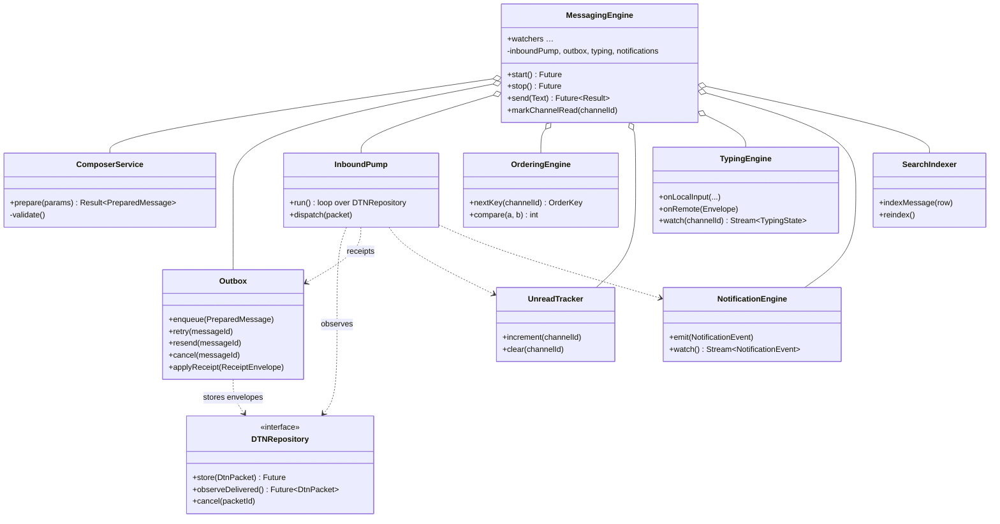
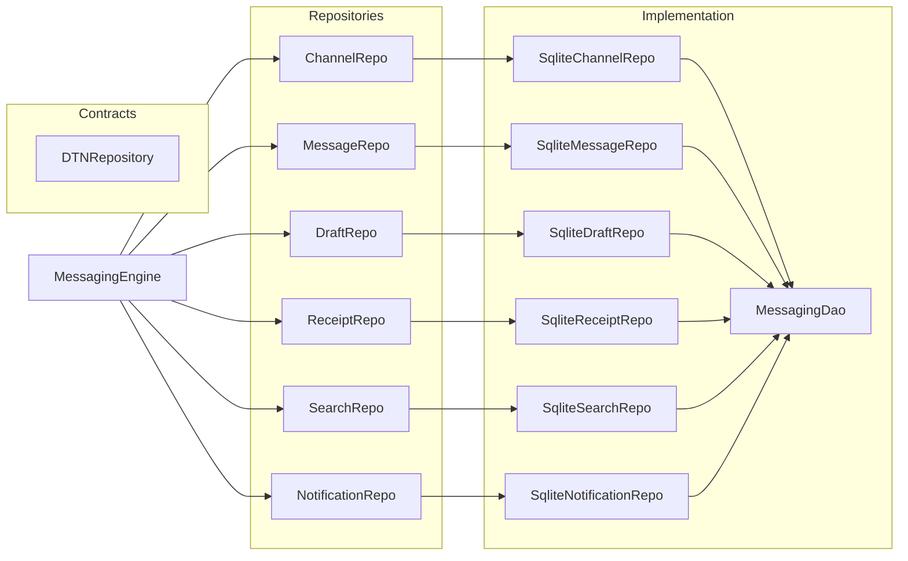
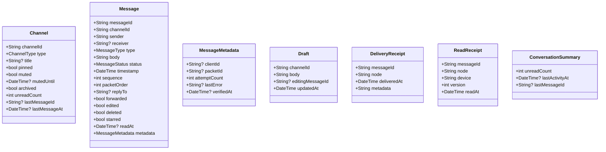

# Class Diagram — Messaging Domain

```mermaid
classDiagram
    direction TB

    class MessagingEngine {
        +start() Future
        +stop() Future
        +send(Text) Future~Result~
        +markChannelRead(channelId)
        +watchers …
        -inboundPump, outbox, typing, notifications
    }
    class DTNRepository {
        <<interface>>
        +store(DtnPacket) Future
        +observeDelivered() Future~DtnPacket~
        +cancel(packetId)
    }

    class ComposerService {
        +prepare(params) Result~PreparedMessage~
        -validate()
    }
    class Outbox {
        +enqueue(PreparedMessage)
        +retry(messageId)
        +resend(messageId)
        +cancel(messageId)
        +applyReceipt(ReceiptEnvelope)
    }
    class InboundPump {
        +run() loop over DTNRepository
        +dispatch(packet)
    }
    class OrderingEngine {
        +nextKey(channelId) OrderKey
        +compare(a, b) int
    }
    class UnreadTracker {
        +increment(channelId)
        +clear(channelId)
    }
    class TypingEngine {
        +onLocalInput(...)
        +onRemote(Envelope)
        +watch(channelId) Stream~TypingState~
    }
    class NotificationEngine {
        +emit(NotificationEvent)
        +watch() Stream~NotificationEvent~
    }
    class SearchIndexer {
        +indexMessage(row)
        +reindex()
    }

    MessagingEngine o-- ComposerService
    MessagingEngine o-- Outbox
    MessagingEngine o-- InboundPump
    MessagingEngine o-- OrderingEngine
    MessagingEngine o-- UnreadTracker
    MessagingEngine o-- TypingEngine
    MessagingEngine o-- NotificationEngine
    MessagingEngine o-- SearchIndexer
    Outbox ..> DTNRepository : stores envelopes
    InboundPump ..> DTNRepository : observes
    InboundPump ..> Outbox : receipts
    InboundPump ..> UnreadTracker
    InboundPump ..> NotificationEngine
```

```mermaid
flowchart LR
    subgraph Repositories
        ChannelRepo
        MessageRepo
        DraftRepo
        ReceiptRepo
        SearchRepo
        NotificationRepo
    end
    subgraph Implementation
        SqliteChannelRepo
        SqliteMessageRepo
        SqliteDraftRepo
        SqliteReceiptRepo
        SqliteSearchRepo
        SqliteNotificationRepo
        MessagingDao
    end
    subgraph Contracts
        DTNRepository
    end

    ChannelRepo --> SqliteChannelRepo
    MessageRepo --> SqliteMessageRepo
    DraftRepo --> SqliteDraftRepo
    ReceiptRepo --> SqliteReceiptRepo
    SearchRepo --> SqliteSearchRepo
    NotificationRepo --> SqliteNotificationRepo
    SqliteChannelRepo --> MessagingDao
    SqliteMessageRepo --> MessagingDao
    SqliteDraftRepo --> MessagingDao
    SqliteReceiptRepo --> MessagingDao
    SqliteSearchRepo --> MessagingDao
    SqliteNotificationRepo --> MessagingDao
    MessagingEngine --> ChannelRepo
    MessagingEngine --> MessageRepo
    MessagingEngine --> DraftRepo
    MessagingEngine --> ReceiptRepo
    MessagingEngine --> SearchRepo
    MessagingEngine --> NotificationRepo
```

```mermaid
classDiagram
    class Channel {
        +String channelId
        +ChannelType type
        +String? title
        +bool pinned
        +bool muted
        +DateTime? mutedUntil
        +bool archived
        +int unreadCount
        +String? lastMessageId
        +DateTime? lastMessageAt
    }
    class Message {
        +String messageId
        +String channelId
        +String sender
        +String? receiver
        +MessageType type
        +String body
        +MessageStatus status
        +DateTime timestamp
        +int sequence
        +int packetOrder
        +String? replyTo
        +bool forwarded
        +bool edited
        +bool deleted
        +bool starred
        +DateTime? readAt
        +MessageMetadata metadata
    }
    class MessageMetadata {
        +String? clientId
        +String? packetId
        +int attemptCount
        +String? lastError
        +DateTime? verifiedAt
    }
    class Draft {
        +String channelId
        +String body
        +String? editingMessageId
        +DateTime updatedAt
    }
    class DeliveryReceipt {
        +String messageId
        +String node
        +DateTime deliveredAt
        +String metadata
    }
    class ReadReceipt {
        +String messageId
        +String node
        +String device
        +int version
        +DateTime readAt
    }
    class ConversationSummary {
        +int unreadCount
        +DateTime? lastActivityAt
        +String? lastMessageId
    }
```